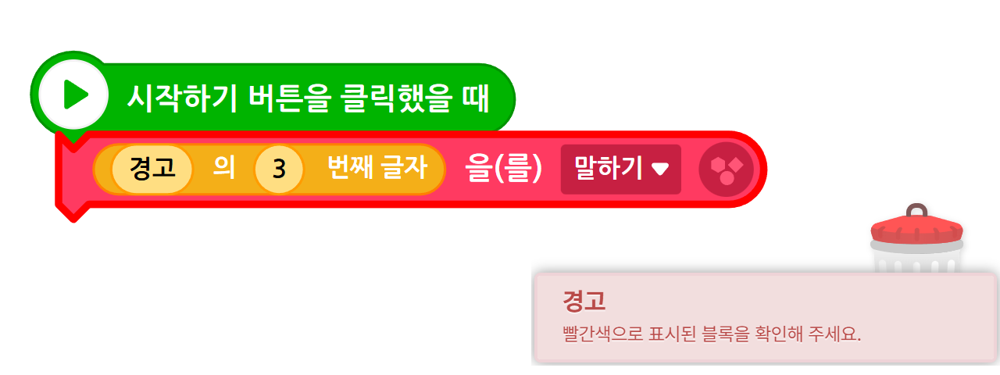
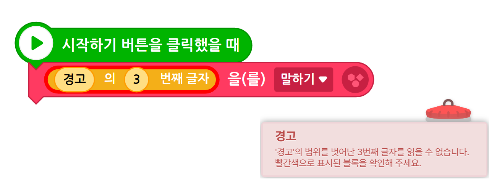

# Entry Toastify
엔트리 작품에서 발생하는 경고 메시지를 직관적으로 변경해줍니다.

엔트리에서 실행 중 발생하는 **애매한 경고 메시지와 잘못된 블록 하이라이트 문제를 개선**하는 크롬 확장 프로그램입니다.

> ❌ 엉뚱한 블록이 빨갛게 표시됨  
> ❌ 함수 안에서 오류가 나도 위치를 찾기 어려움  
> ❌ "런타임 오류"만 뜨고 뭐가 문제인지 알 수 없음  

👉 이 확장 프로그램은 **실제 오류가 발생한 블록을 정확히 표시**하고,  
👉 **사람이 이해할 수 있는 오류 메시지**로 바꿔 줍니다.

## ✨ 주요 기능

- ✅ 오류가 발생한 **정확한 블록을 자동 하이라이트**
- ✅ 함수 내부 오류도 **실제 위치로 이동**
- ✅ 엔트리 기본 경고 메시지를 **구체적인 설명으로 개선**
- ✅ 글상자 / 리스트 / 변수 / 좌표 / 계산 / 데이터분석 오류 지원
- ✅ 한국어 / 영어 오류 메시지 지원
- ✅ 엔트리 코드 수정 없이 **확장 프로그램만으로 동작**

## 🖼️ 예시 (Before / After)

### ❌ Before
- 오류와 상관없는 블록이 선택됨
- 메시지가 “빨간색으로 표시된 블록을 확인해 주세요”로만 표시됨

### ✅ After
- 실제 오류가 발생한 블록이 강조 표시됨
- 왜 오류가 났는지 바로 알 수 있음

Before                              | After
:----------------------------------:|:---------------------------------:
 | 

## 🧩 지원하는 오류 유형 (일부)

- 신호 대상이 없을 때
- 함수 안에서 잘못된 값 반환
- 글상자에 효과 / 모양 적용 시도
- 리스트 범위를 벗어난 접근
- 문자열 범위 초과 (글자 / 부분 문자열)
- asin / acos 정의역 초과
- 팩토리얼 계산 오류
- 변수 / 지역변수 대상 없음
- 데이터분석 테이블 행·열·셀 오류
- 평균 / 합계 / 최댓값 계산 실패 등

## 🛠️ 설치 방법 (수동 설치)

### 1️⃣ 이 저장소 다운로드
- `Code` → `Download ZIP`
- 또는 `git clone`
- `build` 폴더만 압축 해제

### 2️⃣ 크롬 확장 프로그램 페이지 열기
chrome://extensions

### 3️⃣ 개발자 모드 활성화
- 우측 상단 **개발자 모드 ON**

### 4️⃣ 확장 프로그램 로드
- **압축해제된 확장 프로그램 로드**
- 다운로드한 `build` 폴더 선택

✅ 끝!  
이제 엔트리 작품을 실행하면 자동으로 적용됩니다.

## ⚠️ 주의사항

- 엔트리 **웹 버전**에서만 동작합니다.
- 엔트리 내부 업데이트로 인해 일시적으로 동작이 바뀔 수 있습니다.

## 🌱 앞으로 추가될 기능

- 오류 메시지 더 세분화
- 더 많은 엔트리 블록 지원

## 🙌 기여 / 피드백

- 오류 메시지 제안
- 잘못 표시되는 케이스 제보
- 언어팩 개선 제안

모두 환영입니다!
